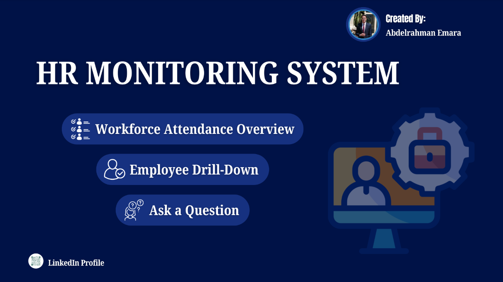

# HR-attendance-analytics-monitoring-system

  

**Technologies Used:** Excel · Power Query · Power Pivot · Power BI · DAX · Data Modeling  

---

## Project Overview
The **HR Attendance Monitoring System** is an end-to-end analytics project that transforms raw employee attendance logs into an interactive HR monitoring system.  
The system provides full visibility into workforce attendance patterns, leave behavior, and operational trends, supporting both high-level monitoring and detailed employee-level analysis.

---

## Dataset
- **Source:** 3 months of employee attendance logs stored across 3 Excel worksheets  
- **Original Structure:**  
  - Rows represent employee names  
  - Columns represent daily calendar dates  
  - Cell values store attendance status codes such as `P` (Present), `SL` (Sick Leave), `PL` (Paid Leave), `WFH` (Work From Home), and others  

---

## Data Transformation & Modeling
- Unpivoted date columns using **Power Query** to convert wide-format data into a proper `Date` field  
- Standardized attendance statuses into a single `Value` column  
- Applied data cleaning and normalization to handle inconsistencies and missing values  
- Created a reusable **Power Query function** to apply the same transformation logic across all worksheets  
- Appended all sheets into a single, unified, date-ordered fact table  
- Built multiple **flag columns** for each attendance type to support DAX calculations  
- Developed **DAX measures** for Presence %, WFO %, WFH %, Paid Leave %, Unpaid Leave %, Sick Leave %, and additional metrics  

---

## Dashboards & Features

### Workforce Attendance Overview
- KPI scorecards displaying total working days, present days, WFO days, WFH days, and leave days  
- Line chart illustrating presence percentage trends over the three-month period  
- Clustered column chart showing monthly leave type distribution  
- Daily attendance distribution table revealing operational patterns such as reduced attendance on Thursdays and Fridays with increased WFH  

### Employee Drill-Down
- Searchable table displaying attendance and leave percentages per employee  
- Identification of top performers with perfect attendance for recognition or incentives  
- Matrix-style daily attendance view enabling HR to track exactly when employees were present, absent, or on leave  

### Ad-hoc Analysis / Q&A
- Enables HR users to ask specific questions such as identifying the top 10 employees by total leave days  
- Provides self-service, interactive analysis for quick and data-driven HR decisions  

---

## Tech Stack
- **Data Preparation & Transformation:** Excel, Power Query, Power Pivot  
- **Analytics & Visualization:** Power BI, DAX, Data Modeling  

---

## Impact
This project delivers a clean, scalable, and interactive HR monitoring system that empowers HR teams to:
- Monitor workforce attendance effectively  
- Identify leave and presence patterns  
- Support operational planning and workforce optimization  
- Make informed, data-driven HR decisions  

---

## 🛡️ License

This project is licensed under the **MIT License**.  
You are free to use, modify, and distribute this project with proper attribution.

---

## 🌟 About Me

Hi! I'm **Abdelrahman Emara**, a **Data Analyst** aspiring to become a **Data Scientist**.  
I have a background in **Telecommunication Engineering** and a strong interest in data analytics, data pipelines, and transforming raw data into actionable insights.

Let’s connect 👇

